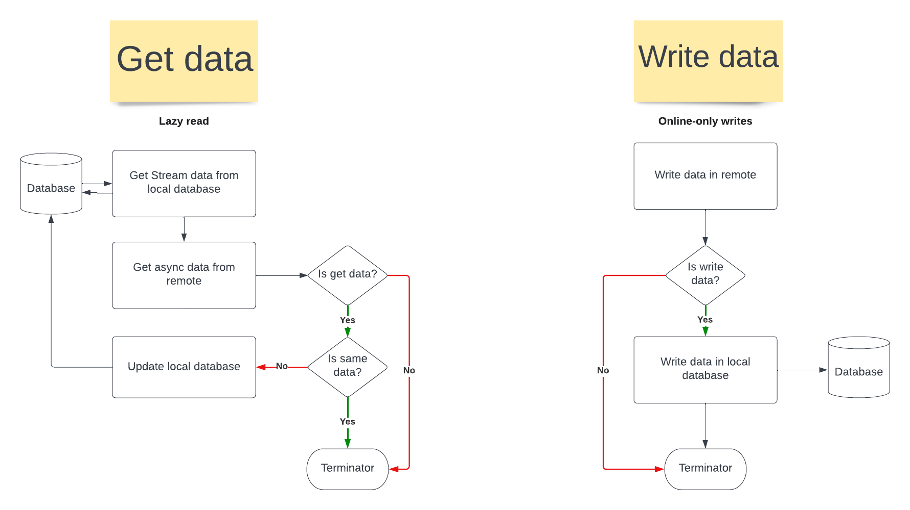

# Build an offline-first app

An offline-first app is an app that is able to perform all, or a critical subset of its core functionality without access to the internet. That is, it can perform some or all of its business logic offline.

Considerations for building an offline-first app start in the data layer which offers access to application data and business logic. The app may need to refresh this data from time to time from sources external to the device. In doing so, it may need to call on network resources to stay up to date.

Network availability is not always guaranteed. Devices commonly have periods of spotty or slow network connection. Users may experience the following:

Limited internet bandwidth
Transitory connection interruptions, such as when in an elevator or a tunnel.
Occasional data access. For example, WiFi-only tablets.
Regardless of the reason, it is often possible for an app to function adequately in these circumstances. To ensure that your app functions correctly offline, it should be able to do the following:

Remain usable without a reliable network connection.
Present users with local data immediately instead of waiting for the first network call to complete or fail.
Fetch data in a manner that is conscious of battery and data status. For example, by only requesting data fetches under optimal conditions, such as when charging or on WiFi.
An app that can satisfy the criteria above is often called an offline-first app.

For more details pleas read this
[document](https://developer.android.com/topic/architecture/data-layer/offline-first#write-strategies).

## FlowChart

This FlowChart fr this app.

